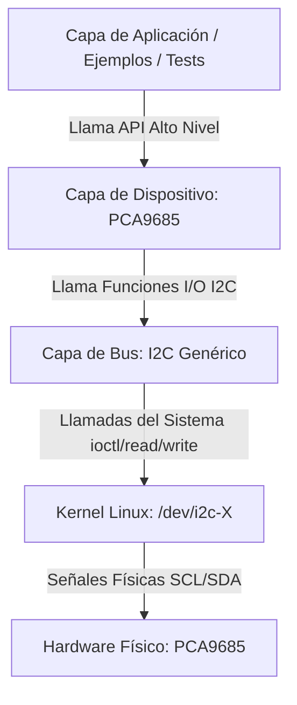

# Arquitectura del Sistema: Driver PCA9685

## 1. Estructura de Directorios

El código del proyecto se organiza bajo la siguiente estructura modular:

```text
i2c-driver-pca9685/
├── docs/                      # Documentación técnica
│   ├── hardware_research.md   # Investigación del PCA9685
│   ├── PCA9685.pdf            # Datasheet del PCA9685
│   └── system_architecture.md # Arquitectura del software
├── include/                   # Archivos de cabecera públicos (.h)
│   ├── i2c.h                  # Interfaz genérica del bus I2C
│   └── pca9685.h              # Interfaz del driver PCA9685
├── src/                       # Código fuente de implementación (.c)
│   ├── i2c/
│   │   └── i2c.c              # Implementación de comunicaciones I2C Linux
│   └── pca9685/
│       └── pca9685.c          # Implementación del driver del hardware
├── examples/                  # Programas de demostración de uso
│   └── main_demo.c            # Demostración básica de uso
├── tests/                     # Pruebas automatizadas
│   ├── test_unit.c            # Pruebas unitarias de software
│   └── test_integration.c     # Pruebas de integración con hardware real
├── Makefile                   # Automatización de la compilación
└── README.md                  # Presentación general del proyecto
```

---

## 2. Separación de Responsabilidades en Capas

Para garantizar que el software sea robusto, testeable y portable, se divide estrictamente en tres niveles de abstracción:



### Capa 1: Capa de Bus I2C Genérica (`include/i2c.h` y `src/i2c/i2c.c`)
*   **Responsabilidad:** Administrar la comunicación en bajo nivel sobre el protocolo I2C mediante las utilidades del espacio de usuario del kernel Linux (abrir `/dev/i2c-*`, control de esclavo a través de `ioctl` con `I2C_SLAVE`, operaciones de lectura/escritura).
*   **Agnosticismo:** Esta capa **no sabe nada** sobre el PCA9685, ni sobre servomotores, ni registros de PWM. Podría ser utilizada en el futuro para leer un sensor de temperatura o cualquier otro chip I2C sin alterar una línea de su código.
*   **Manejo de Errores:** Valida descriptores de archivo y retorna códigos `i2c_status_t` claros en lugar de fallar silenciosamente.

### Capa 2: Capa del Dispositivo PCA9685 (`include/pca9685.h` y `src/pca9685/pca9685.c`)
*   **Responsabilidad:** Traducir los comandos del desarrollador (ej. establecer ciclo de trabajo, frecuencia o encendido) en comandos físicos de registros binarios específicos del PCA9685 descritos en el Datasheet.
*   **Dependencia:** Se acopla e interactúa directamente con la capa I2C pasándole su estructura de contexto interna `i2c_device_t`.
*   **Lógica de Negocio del Chip:** 
    *   Controla el encendido y apagado de bits de control (como el modo Sleep para escribir en `PRE_SCALE`).
    *   Realiza las conversiones matemáticas de frecuencias a valores de pre-escalador y de porcentajes a cuentas de ticks (0-4095).

### Capa 3: Capa de Pruebas y Consumo (`tests/` y `examples/`)
*   **Ejemplos:** Programas demostrativos que interactúan con la API de alto nivel para resolver un problema final (ej. mover un servomotor en ciclos).
*   **Tests Unitarios:** Verifican lógica pura del driver (ej. ¿retorna error de rango si pido el canal 16? ¿el cálculo de frecuencia redondea de forma correcta?).
*   **Tests de Integración:** Hacen correr el driver completo sobre hardware real y validan que el chip responda correctamente escribiendo valores y leyendo de regreso para confirmar.

---

## 3. Flujo de Datos y Encapsulación

El diseño técnico utiliza **orientación a objetos estructurada en C** mediante la inyección y el paso de punteros de contexto. La estructura del PCA9685 engloba la del bus I2C:

```c
typedef struct {
    i2c_device_t i2c_dev;  // Contexto de comunicación inyectado e interno
    bool is_initialized;   // Estado de control
    float current_freq;    // Cache del estado del hardware
} pca9685_t;
```

Esto permite al usuario final solo tener que administrar la instancia de su dispositivo `pca9685_t`, logrando que la API sea sumamente limpia, transparente y encapsulada.
